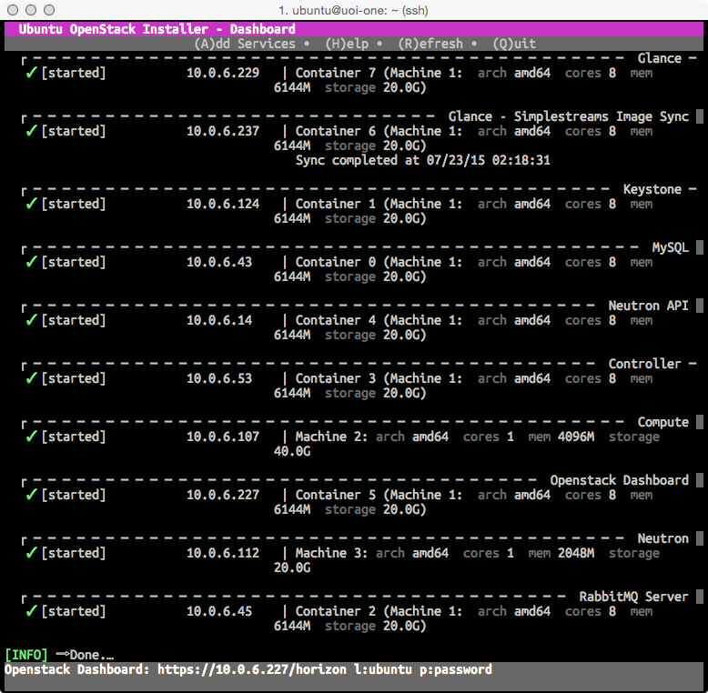

Title: Ubuntu OpenStack Installerを使った1Node OpenStack
Company: 日本仮想化技術
Version:0.9.2

#Ubuntu OpenStack Installerを使った1Node OpenStack

<div class="title">
バージョン：0.9.2 (2015/10/30作成)<br>
日本仮想化技術株式会社
</div>

<!-- BREAK -->

##変更履歴

|バージョン|更新日|更新内容|
|:---|:---|:---|
|0.9.0|2015/07/23|Kilo対応|
|0.9.1|2015/10/28|公式サイトに合わせた修正。kilo動作確認済|
|0.9.2|2015/10/30|削除方法の追加。juno動作確認済|


<!-- BREAK -->

##目次
<!--TOC max3-->

<!-- BREAK -->


##コマンドについて

次のように記述したコマンドはホスト上で実行します。

````
$ command
````

次のように記述したコマンドはComputeノード上で実行します。

````
Compute$ command
````

コマンドに管理権限が必要な場合はsudoコマンドをつけて実行しますが、下記のように記述しているコマンドは`sudo -i`で管理者権限に切り替えてから実行してください。

````
# command
````


## 1. 構築する環境について

### 1-1 環境構築に使用するOS

本書はCanonicalのUbuntu ServerとUbuntu OpenStack Installerを使って、LXC上でOpenStack Kiloを動作させる手順を解説したものです。

OSはUbuntu Server 14.04.3 LTS(以下Ubuntu Server)を使用します。以下のURLよりイメージをダウンロードし、各サーバーへインストールします。

- <http://releases.ubuntu.com/14.04/ubuntu-14.04.3-server-amd64.iso>

### 1-2 ベースとなっているドキュメントについて

本書は下記のドキュメントの2015年10月28日時点の内容をベースとして、日本語で手順を記述したものです。

- <http://openstack.astokes.org/guides/single-install>

### 1-3 サーバーの構成について

本書はOpenStack環境を1台のサーバー上にLXCベースで構築することを想定しています。LXCは事前にインストールする必要はありません。Ubuntu OpenStack Installerによって自動的に必要なパッケージをインストールできます。

次のスペックを満たすサーバーが必要です。

- 8Core以上のCPU
- 12GB以上のメモリー
- 100GB以上のストレージ

### 1-4 ネットワークセグメントの設定

事前に必要なネットワーク設定は、管理用のネットワークだけで構いません。Ubuntu OpenStack Installerによって構築されるOpenStackの各コンポーネントは、LXCのネットワーク上で稼働するためです。各コンポーネントにSSH接続する場合は、ホストマシンから接続してください。

<!-- BREAK -->

### 1-5 Ubuntu Serverのインストール

#### 1-5-1 インストール

まず、Ubuntu Serverをインストールします。要点は以下の通りです。キーボードの設定や優先するNICの設定は各環境に合わせてください。

【インストール時の設定パラメータ例】

|設定項目|設定例|
|:---|:---|
|初期起動時のLanguage|English|
|起動|Install Ubuntu Server|
|言語|English - English|
|地域の設定|other→Asia→Japan|
|地域の言語|United States - en_US.UTF-8|
|キーボードレイアウトの自動認識|No|
|キーボードの言語|Japanese→Japanese|
|優先するNIC|eth0: Ethernet|
|ホスト名|適切なものを設定|
|ユーザ名とパスワード|フルネームで入力|
|アカウント名|ユーザ名のファーストネームで設定される|
|パスワード|任意のパスワード|
|Weak password（出ない場合も）|Yesを選択|
|ホームの暗号化|任意|
|タイムゾーン|Asia/Tokyoであることを確認|
|パーティション設定|Guided - use entire disk and set up LVM|
|パーティション選択|sdaを選択|
|パーティション書き込み|Yesを選択|
|パーティションサイズ|デフォルトのまま|
|変更の書き込み|Yesを選択|
|HTTP proxy|環境に合わせて任意|
|アップグレード|No automatic updatesを推奨|
|ソフトウェア|OpenSSH serverのみ選択|
|GRUB|Yesを選択|
|インストール完了|Continueを選択|

<!-- BREAK -->

```
筆者注:
Ubuntuインストール時に選択した言語がインストール後も使われます。
Ubuntu Serverで日本語の言語を設定した場合、標準出力や標準エラー出力が文字化けするなど
様々な問題が起きます。
Ubuntu Serverでは言語として英語を設定されることを推奨します。
```


### 1-6 Ubuntu Serverへのログインとroot権限

Ubuntuはデフォルト設定でrootユーザーの利用を許可していないため、root権限が必要となる作業は以下のように行ってください。

+ rootユーザーで直接ログインできないので、インストール時に作成したアカウントでログインする。
+ root権限が必要な場合には、sudoコマンドを使用する。
+ rootで連続して作業したい場合には、sudo -iコマンドでシェルを起動する。

<!-- BREAK -->


## 2. Ubuntu OpenStack Installerのセットアップ

Ubuntu Serverのインストールが終わったら、次の手順でUbuntu OpenStack Installerのセットアップを行います。PPAの追加、システムアップデートを行います。

### 2-1 事前に必要なパッケージのインストール

PPAの追加を行うコマンドの実行に必要なパッケージと、iptablesの設定を永続化するためのパッケージをインストールします。

````
$ sudo apt-get install software-properties-common python-software-properties iptables-persistent
````

### 2-2 リポジトリーを追加

リポジトリーを追加します。

````
$ sudo apt-add-repository ppa:cloud-installer/stable
````

リポジトリーを追加したら、aptコマンドでパッケージをインストールできるようにするため、リポジトリーパッケージ情報の更新とシステムアップデートを実施します。

````
$ sudo apt-get update && sudo apt-get -y upgrade
````

### 2-3 Ubuntu OpenStack Installerのインストール

次のように実行して、Ubuntu OpenStack Installerをインストールします。

````
$ sudo apt-get install -y openstack
````

<!-- BREAK -->

## 3. OpenStackのデプロイ

Ubuntu OpenStack Installerのインストールが終わったら、次の手順でOpenStackのデプロイを行います。インストールはコマンドを実行するだけなので簡単です。

### 3-1 OpenStackのデプロイ

次のように実行して、Ubuntu OpenStack InstallerでOpenStackをデプロイします。デプロイするOpenStackのバージョンを指定することができます。現時点でサポートされるのはicehouse、juno、kilo、libertyです。

```
$ sudo openstack-install --openstack-release kilo
```

デプロイ中はアニメーションでデプロイ中の状況が表示されます。構築の状況はUbuntu OpenStack Installerのダッシュボードや`watch pstree`などのコマンドなど使って確認するとわかりやすいです。

デプロイが終わると各ノードのIPアドレスやサービスのデプロイ状況などが表示されます。



<!-- BREAK -->

### 3-2 Computeの設定を変更

Ubuntu OpenStack Installerによるシングルインストールでは、OpenStackの各サービスがLXCベースで構築されます。LXC上でKVMは動作しないため、UbuntuのNova ComputeノードのNovaの設定をkvmからqemuに修正する必要があります。次のように実行します。

#### 3-2-1 Computeノードへのアクセス

Computeノードは「openstack-installを実行したユーザーで」sshコマンドでアクセスします。IPアドレスをUbuntu OpenStack Installer Dashboardで確認し、ubuntuユーザーでsshコマンドでログインします。

````
$ ssh ubuntu@ComputeノードのIPアドレス
````

Ubuntu OpenStack Installer Dashboardが表示されていない場合は、`openstack-status`コマンドを実行します。

````
$ openstack-status
````

#### 3-2-2 プロセスの確認

Nova-Computeの設定を変更にnova-computeプロセスを再起動するために、プロセスを確認します。実行中のプロセスをコピーしてエディターなどにメモしておきます。

````
Compute$ ps ax|grep nova
....
 5372 ?        Sl     0:01 /usr/bin/python /usr/bin/nova-compute --config-file=/etc/nova/nova.conf --config-file=/etc/nova/nova-compute.conf ← このプロセスをコピー
 5614 pts/3    S+     0:00 grep --color=auto nova
````

<!-- BREAK -->

#### 3-2-3 設定変更と反映

仮想マシンタイプの設定を書きかえます。Ubuntuではnova-compute.confを修正します。

````
Compute$ sudo vi /etc/nova/nova-compute.conf
...
[libvirt]
virt_type=qemu
````

先ほど3-2-2で確認したプロセスをkillコマンドで停止します。そのあとコマンドをペーストし、Novaプロセスを再起動します。

````
Compute$ sudo -i
Compute# /usr/bin/python /usr/bin/nova-compute --config-file=/etc/nova/nova.conf --config-file=/etc/nova/nova-compute.conf &  ← &をつけてバックグラウンドで実行
...
Compute# ps ax|grep nova      ← プロセスを確認
...
 6655 ?        Sl     0:01 /usr/bin/python /usr/bin/nova-compute --config-file=/etc/nova/nova.conf --config-file=/etc/nova/nova-compute.conf 
````

<!-- BREAK -->


## 4. OpenStackへのアクセス

### 4-1 iptablesを設定

OpenStackはLXC Network上でノードが稼働しているため、PublicからアクセスできるようにするためにiptablesにNAT転送を設定します。ホストのIPアドレスが172.17.14.100で、DashboardのIPアドレスが10.0.6.227の場合は、次のように実行します。

````
$ sudo -i
# iptables -t nat -A PREROUTING -p tcp -d 172.17.14.100 --dport 9000 -j DNAT --to-destination 10.0.6.227:443
# service iptables-persistent save
````

### 4-2 Dashboardへアクセス

NAT転送を設定したら外部PCからOpenStack Dashboardにブラウザーでアクセスできるようになります。

````
https://172.17.14.100:9000/horizon
````

管理ユーザーとしてadminユーザー、一般ユーザーとしてubuntuユーザーが登録されています。パスワードはUbuntu OpenStack Installer実行時に最初に設定したパスワードが設定されており、それぞれを入力するとログイン可能です。

### 4-3 Dashboardの操作

Dashboardの操作方法などは次の弊社サイトで公開されている情報などを参考にしてください。

- <http://www.slideshare.net/VirtualTech-JP/14012703openstack-vmadd>
- <http://enterprisecloud.jp/installguide-openstack/>

<!-- BREAK -->


## 5. OpenStackの削除

Ubuntu OpenStack InstallerでデプロイしたOpenStack環境の停止は`sudo openstack-install -u`で行うことができます。

エラーになり`sudo openstack-install -u`が完了しない場合は、`lxc-ls`ででできたコンテナーを`lxc-stop`で停止、`lxc-destroy`で削除した後`~/.cloud-install`を削除してください。